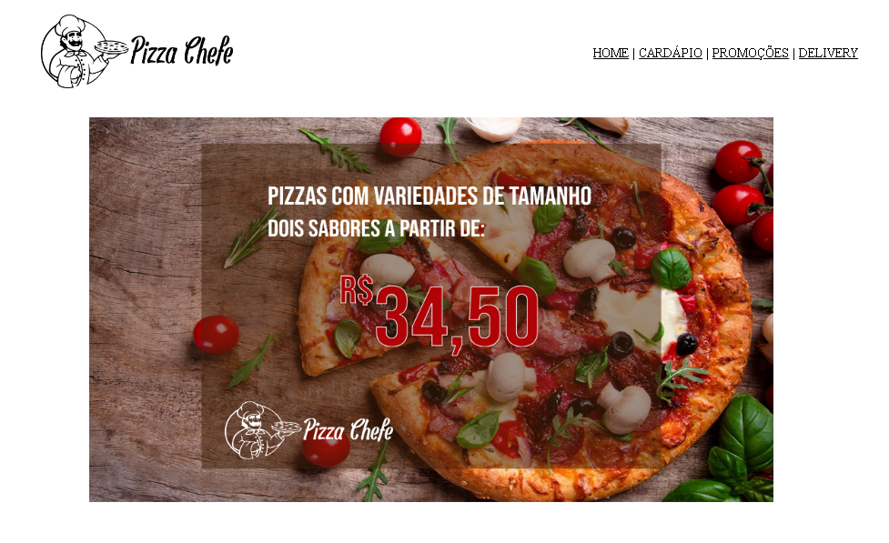

<h4>Olá comunidade conectada, me chamo Bruno Lucas e sou um estudante da área de programação web, hoje vim aqui trazer um processo das etapas de um projeto pessoal que criei usando Html5 e Css .Espero que gostem!</h4>
 

Este projeto séra divido em etapas e aqui você podera ver o resultado final. Caso queira ver as outras vesões deste projeto os arquivos estarão disponiveis nesse repositório.

<h5>Versão e Atualização 1.0:  (15/02/23)</h5>

 

Este versão 1.0 contém: Html5 básico (imagens,títulos,páragrafos,links,formulário,tabelas) Css Básico (css inline)

Resumo desta etapa: O projeto Pizza Chefe é um projeto totalmente fictício (imagens,logo,nomes), e seu objetivo final é a prática dessas tecnologias e linguagens utilizadas para tal. No site tem 1 página home e um menu de navegação com mais outras 3 páginas. As páginas são home(apresentação), cardápio(lista de itens), promoções(lista de promoções),delivery(formulário do pedido).

